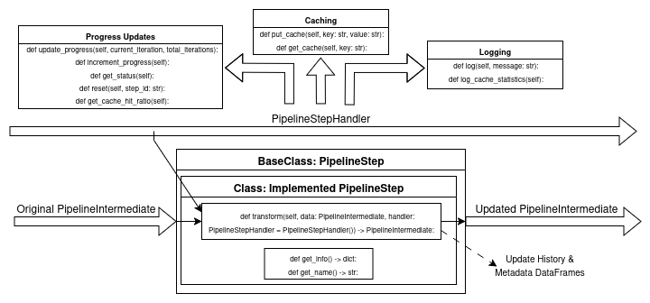
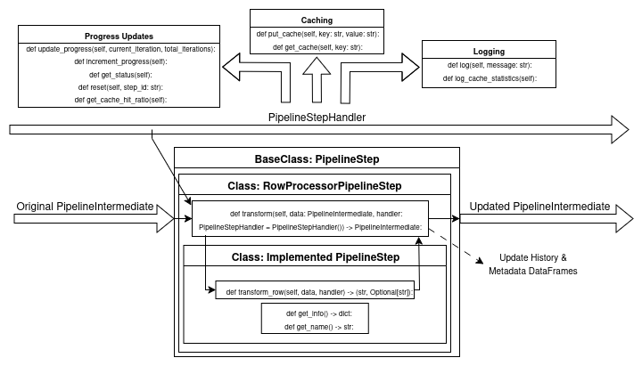
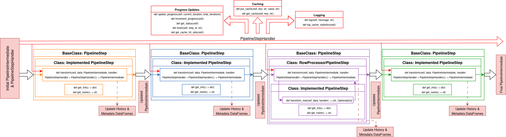

# Mosaic-RAG
ad
This is MOSAIC-RAG, a retrieval system and retrieval augmented generation library for Mosaic (and other data sources).


Mosaic-RAG
mosaicRAG
MOSAIC-RAG
MosaicRag


MOSAIC und MOSAIC-RAG

Mosaic und MosaicRag

Mosaic und MosaicRAG

Mosaic und mosaicRAG


#### Links:
- [mosaicRAG](https://mosaicrag.ows.eu)
- [mosaicRAG Repository](https://github.com/nextormer/mosaic-rag)
- [mosaicRAG-frontend Repository](https://github.com/nextormer/mosaic-rag-frontend)

#### Table of contents

- [Building and running](#building-and-running)
- [Features and roadmap](#features)
- [API documentation](#api)
- [Documentation of available pipeline steps](#pipeline-steps)

## Building and running
The frontend is automatically bundled with the mosaicRAG instance. 
Access it by going to the root directory of the server in your browser.

### Docker image (recommended)

We publish and maintain a docker image for the mosaicRAG service.
This is the recommended way to deploy the service for production use.
MosaicRAG exposes the API (see documentation) and the mosaicRAG Frontend interface on port 5000.
Use the docker's port mapping feature to re-map the port to your desired port.

We offer two versions of the docker image: 
`mosaicrag:latest` and `mosaicrag:latest-x86`.
`mosaicrag:latest` is built for arm64 architecture and `mosaicrag:latest-x86` is built for x86 architecture.

#### For testing
For testing you can run the image directly with `docker run`.

**For ARM64:**
```shell
docker run -p 80:5000 --name mosaicrag -d git.felixholz.com/mosaicrag:latest
```

**For AMD64:**
```shell
docker run -p 80:5000 --name mosaicrag -d git.felixholz.com/mosaicrag:latest-x86
```

#### Running in production
For running mosaicRAG in production we advise you to use docker compose. 
Docker compose automatically manages other services, such as redis or an LLM.
Additionally, using docker compose makes it easy to specify environment variables. 
Have a look at the root of this repository for an example `docker-compose.yml` file.


**Running the service**
After setting up the `docker-compose.yml` file, use the following command to start the service:

```shell
docker-compose up -d
```

**Updating the service**
The frontend automatically gets updated when the mosaicRAG server starts, so restarting the server updates the frontend to the latest version.
For mosaicRAG itself, use the following commands to update a running instance:

```shell
docker-compose down
docker-compose pull
docker-compose up -d  
```


#### Environment Variables

| Variable | Description | Default Value | Example |
| -------- | ------- | ------------ | ------- |
| `REDIS_HOST` | Specifies the hostname or IP address of the Redis instance. | None | `REDIS_HOST=172.17.0.1` |
| `COLOR_THEME` | Defines the visual color scheme of the application's UI. | orange-dark | `COLOR_THEME=blue-dark` |
| `APP_TITLE` | Sets the primary title displayed at the top of the application. | mosaicRAG | `APP_TITLE="My RAG App"` |
| `APP_SUBTITLE` | Sets the subtitle displayed beneath the main title. | the version and build number of the frontend | `APP_SUBTITLE="an OpenWebSearch.eu Project"` |
| `APP_PIPELINE_CONFIG_ALLOWED` | Boolean (true/false) that controls if users can configure the data pipeline from the UI. | true | `APP_PIPELINE_CONFIG_ALLOWED=false` |
| `APP_LOGS_ALLOWED` | Boolean (true/false) that determines if application logs are accessible in the UI. | true | `APP_LOGS_ALLOWED=false` |
| `APP_DEFAULT_PIPELINE` | A JSON string that defines the default pipeline configuration. | {"1": {"id": "mosaic_datasource", ...}} | `APP_DEFAULT_PIPELINE='{"1": ...}'` |
| `APP_ABOUT_LINK_TITLE` | Sets the display text for the "About" link. | About MOSAIC | `APP_ABOUT_LINK_TITLE="Learn More"` |
| `APP_ABOUT_LINK_URL` | Sets the destination URL for the "About" link. | https://mosaic.ows.eu/ | `APP_ABOUT_LINK_URL="https://mycompany.com" `|


### Local using flask
MosaicRAG uses Flask as the webserver. 
During development, you can run moaicRAG with the following command from the `/app/` directory:

```shell
flask run
```

### Building the docker image

Build the docker image with this command:

```shell
docker build -t mosaicrag:latest
```

## Features:
- build your own retrieval pipeline
  - summarizers, rerankers, preprocessors, metadata analyzers
- (basic) conversational search
- public API
- analyze search data

### Future features:
- Topic modelling
- persistent pipeline 
- improve RAG features
- query enhancement
- explainability
- knowledge graphs


## API

The API supports running tasks synchronously, asynchronously, fetching status of asynchronous tasks, cancelling asynchronous tasks and fetching all available pipeline steps and configuration options.

### Serve Frontend

#### `GET /`
Serves the `index.html` of the Flutter web application.

#### `GET /<path:filename>`
Serves static files (JS, CSS, images, etc.) for the Flutter web application.
- `filename`: The path to the static file.

### Run task synchronously
Starts a RAG task on the server.
Returns response when task is complete, may take several minutes depending on the pipeline configuration.

`POST /task/run`

Parameters in request body as JSON:
- `query` Query string given to the DataSource (i.e. mosaic)
- `parameters` Map of parameters given to the DataSource (e.g. limit=10)
- `1` 1st pipeline step configuration
- `2` 2nd pipeline step configuration
- `n` nth pipeline step configuration

Each pipeline step is defined as follows:
- `id` Class ID for the PipelineStep (e.g. `mosaic_datasource`)
- `parameters` Key-value pairs of the parameters (see PipelineSteps documentation)

Returns a JSON object containing the task status and results upon completion. The structure is the same as the response from `GET /task/progress/<taskID:string>` when `has_finished` is
true.

### Run task asynchronously
Starts a RAG task on the server.
Returns a `taskID`, which is used to cancel or request the status of this task.

`POST /task/enqueue`

Parameters in request body as JSON:
- `query` Query string given to the DataSource
(i.e. mosaic)
- `parameters` Map of parameters given to the DataSource (e.g. limit=10)
- `1` 1st pipeline step configuration
- `2` 2nd pipeline step configuration
- `n` nth pipeline step configuration

Each pipeline step is defined
as follows:
- `id` Class ID for the PipelineStep (e.g. `mosaic_datasource`)
- `parameters` Key-value pairs of the parameters (see PipelineSteps documentation)

Returns:
- `taskID` (text/plain): The ID of the enqueued task.

### Fetch task progress
Request status updates and results for a task given the `taskID` from `POST /task/enqueue`.

`GET /task/progress/<taskID:string>`

- `taskID`: The ID of the task.

Returns task status as JSON:
- `has_finished`:
(boolean) Indicates if the task has completed.
- `progress`: (object) Contains detailed progress information:
  - `current_step`: (string) Name of the current pipeline step being processed.
  - `current_step_index`: (string) The key/identifier of the current step
as defined in the input pipeline (e.g., "1", "2").
  - `pipeline_progress`: (string) Progress formatted as `<steps_initiated_or_processing>/<total_steps>` (e.g., "0/3", "1/3").
  - `pipeline_percentage`: (float) Numeric representation of pipeline progress (0.0 to 1.0), calculated as `steps_initiated_or_processing / total_steps`.
  - `log`: (array of strings) Log messages from the overall pipeline execution and individual steps.
  - `step_output`: (object) A potentially fixed or example output structure related to steps (Note: its current implementation in `PipelineTask.py` shows a static example; dynamic per-step details are typically in `step_progress`).
  - `step_progress`: (object) Contains specific progress updates or log details for each pipeline step, keyed by the step's original identifier (e.g., "mosaic_datasource"). The value for each key is typically an array of strings or structured log entries for that step.
- `result`: (object, present if `has_finished` is true) Contains the final results:
  - `data`: (string) JSON string of the final documents DataFrame.
  - `result_description`: (string) A summary of the task execution (e.g., number of documents, time taken, cache hit ratio).
  - `aggregated_data`: (string) JSON string of aggregated data from the pipeline.
  - `metadata`: (string) JSON string of metadata from the pipeline.

Returns 404 if `taskID` is not found.

### Cancel task

Cancels an asynchronously running task.

`GET /task/cancel/<taskID:string>`

- `taskID`: The ID of the task to cancel.

Returns:
- `Success` (text/plain) if cancellation was initiated.
- `Task id not found` (404)
if the taskID is invalid.

### Chat with RAG results
Provides a conversational interface to interact with the results of a completed pipeline task.

`GET /task/chat/<chatID:string>`

- `chatID`:
    - Use `new` to start a new conversation.
    - Use the `chatID` returned from a previous `new` request to continue an existing conversation.

Query Parameters:
- If `chatID` is `new`:
    - `model`: (string, required) The language model to use for the chat (e.g., gemma2).
    - `column`: (string, required) The column name from the pipeline task's final DataFrame to use as context for the RAG.
    - `task_id`: (string, required) The ID of the completed `PipelineTask` whose results will be used for the conversation.

Returns: A new `chatID` (text/plain) for the created conversation.

- If `chatID` is an existing ID:
    - `message`: (string, required) The user's message/question for the RAG system.

Returns: The model's response (text/plain).

Error Responses:

- 404 Not Found: If `task_id` is not found when `chatID` is `new`.
- 500 Internal Server Error: If an invalid `chatID` is provided for an existing conversation (i.e., chat session not found in server memory).

### Get pipeline info

Fetches information about all available pipeline steps and their configurable parameters.

`GET /pipeline/info`

Returns a JSON object where keys are pipeline step IDs (e.g., `mosaic_datasource`, `llm_summarizer`) and values are objects containing:
- `name`: (string) Display
name of the step.
- `category`: (string) Category of the step (e.g., "Data Sources", "Summarizers").
- `description`: (string) A brief description of what the step does.
- `parameters`: (object) An object detailing the configurable parameters for the step. Each parameter key (e.g., `output_column`, `model`) maps to an object with attributes like:
    - `title`: (string) User-friendly title for the parameter.
    - `description`: (string) Explanation of the parameter.
    - `type`: (string) Input type for the frontend (e.g., `dropdown`, `text`). 
    - `enforce-limit`: (boolean) Whether the frontend should restrict input to `supported-values`.
    - `required`: (boolean) Whether the parameter is mandatory.
    - `supported-values`: (array of strings, optional) Predefined values if `type` is `dropdown`.
    - `default`: Default value for the parameter.


`documentation still in progress`


## PipelineIntermediate
The PipelineIntermediate object serves as the primary means of communication between pipeline steps. Each step in the pipeline receives a PipelineIntermediate object as input and returns the altered one as output. This object consists of three main components:

| Name | Description |
|--|--|
| Documents | This DataFrame contains the current data as modified by the most recent pipeline step, along with individual ranking scores, ranks, and additional metadata such as IDs and URLs.
| History | The history dictionary stores a copy of the documents DataFrame after each individual pipeline step. This allows for detailed analysis of how each step modifies the retrieved data. |
| Metadata | The `metadata` DataFrame contains information about each column in the `documents` DataFrame that has a specific role or purpose. Columns can have one or more of the following properties: `rank`, `text`, or `chip`. Columns marked with the `rank` property are used for ranking purposes. These columns consist of increasing integers starting from 1, where a value of 1 indicates the most relevant document. Relevance decreases as the rank number increases. Columns with the `rank` property are also displayed in the UI within the ranking dropdown menu. Columns with the `text`property contain text which can be used as an output in the UI. All columns with this property are shown in the text-drop-down field in the UI. In columns with the property `chip` are small bits of information (for example the result of a MetadataAnalysis step) which are then display in chip form in the UI for each individual retrieved result.|


## Categories

| Name | Description  |
|--|--|
| Data Sources | This category encompasses all pipeline steps, which bring new data into the RAG system. The steps itself gather data from external services (e.g. MOSAIC, ChromaDB, etc.), bring them into a unified format and save them in the [PipelineIntermediate](#pipelineintermediate). |
| Summarizers | Pipeline steps of this category are used to summarize the retrieved and/or processed text either on an individual level or to get an overall summarization of all returned results.   |
| Pre-Processing | This category hosts a number of basic NLP pre-processing steps which can be used to enhance/change the retrieved full texts from the sources.  |
| Rerankers | Rerankers are used to alter/enhance the ranking of the retrieved results. These rerankers can be based on simple ISR metrics (eg. Cosine, BM25, etc.) or also encompass LLM-Rag features. |
| Metadata Analysis | This category holds pipeline steps which are used for analysis purposes on each individual row.|


## PipelineStepHandler

The `transform()` method is the core function of each pipeline step. It applies the specific modifications to the [`PipelineIntermediate`](#pipelineintermediate) object for that step. Each `transform()` method has two parameters. One is the already mentioned [`PipelineIntermediate`](#pipelineintermediate), which holds the current data, its metadata and the history of intermediate results, and the other parameter is a `PipelineStepHandler` object. The respective class is implemented in the `PipelineStepHandler.py` file. This object is responsible for everything related to caching, updating the progress bar/status and logging additional information. A practical example of how this is used can be seen in the implementation of the `transform()` method in the [`RowProcessorPipelineStep`](#rowprocessorpipelinestep) seen in the tutorial at [`Variation1`](#variation-1-rowprocessorpipelinestep). The methods of the `PipelineStepHandler` object can be put into three different categories:

### 1. Related to Progress updates

- `def update_progress(self, current_iteration, total_iterations):` - Either initially setting up the progress bar by giving the starting iteration count as well as the total number of iterations (e.g. (0, max_num_iteration)) or to overwrite the current progress bar setting by making larger jumps between values of the progress bar or adapting the max iteration count. 

- `def increment_progress(self):` - Increasing the current iteration count by one. The max iteration count keeps the same. Gets most often used in loops to update the progress bar of the UI iteratively. 

- `def get_status(self):` - Returns a dictionary with stats regarding the progress of the current step. This includes the `step_percentage` (percentage of how many steps are already done), `step_progress` (string containing the current number of iterations as well as the max number of iterations in the format: "current/maximum"), and `log` (the logs contained in the PipelineStepHandler).

- `def reset(self, step_id: str):` - Resetting everything progress bar related of the PipelineStepHandler object. Gets called automatically by the UI when the cancel button is pressed. 

- `def get_cache_hit_ratio(self):` - If `self.caching_enable` is true, return the ratio of cache hits to misses. If  `self.caching_enable` is false return 0.


### 2. Related to Caching

- `def put_cache(self, key: str, value: str):` - If `self.caching_enable` is true, save the `value` into the cache using the `key` and the current `self.step_id` together as a key.

- `def get_cache(self, key: str):` - If `self.caching_enable` is true, try to get the value with the current `self.step_id` and `key` together as a ID. If the entry exists return the cache entry and increase the number of cache hits (`self.cache_hits`). If not return None and increase the number of cache misses (`self.cache_misses`).

### 3. Related to Logging/Information

- `def log(self, message: str):` Is used by develpoers to print data to the log output of the MOSAICRAG log window which can be found in the UI under "Logs". Only works if the variable `self.logs_lock` is true. 

- `def log_cache_statistics(self):`  If `self.caching_enable` is true, logs the number of cache hits and misses. 


## Pipeline steps

### PipelineStep

This is the abstract base class for all pipeline steps. It must either be directly implemented by each step or be present somewhere in the class’s inheritance hierarchy (e.g., via [`RowProcessorPipelineStep`](#rowprocessorpipelinestep).

It defines the following abstract methods:

- `def transform(self, data: PipelineIntermediate, handler: PipelineStepHandler) -> PipelineIntermediate:`

- `def get_info() -> dict:`

- `def get_name() -> str:`

The `transform()` method is the core function of each pipeline step. It applies the specific modifications to the [`PipelineIntermediate`](#pipelineintermediate) object for that step.
The two static methods, `get_info()` and `get_name()`, provide metadata about the step. They are primarily used to supply descriptive information to the frontend.

----------


### RowProcessorPipelineStep

`RowProcessorPipelineStep` implements the [`PipelineStep`](#pipelinestep) interface but serves as a specialized base class meant to be extended by other pipeline steps. It overrides the `transform` method from [`PipelineStep`](#pipelinestep)  and introduces a new abstract method that must be implemented by any subclass deriving from it:

- `def transform_row(self, data, handler: PipelineStepHandler) -> (any, Optional[str]):`

`RowProcessorPipelineStep` provides a framework for iterating over the `PipelineIntermediate` object row by row, applying a transformation—defined in the `transform_row` method—to each string in a selected column.
It handles all responsibilities related to caching, updating the [`PipelineIntermediate`](#pipelineintermediate), and tracking progress. As a result, subclasses implementing `RowProcessorPipelineStep` only need to define the core transformation logic in `transform_row`, without worrying about the surrounding infrastructure.

----------


### MosaicDataSource
- **UI-Name:** `MosaicDataSource`
-   **Category:** [Data Sources](#categories)
-   **Implements:** [`PipelineStep`](#pipelinestep)
    

#### Description

The `MosaicDataSource` is a [`PipelineStep`](#pipelinestep) used as the primary source of data, designed to integrate with the existing [MOSAIC tool](https://opencode.it4i.eu/openwebsearcheu-public/mosaic). It retrieves an initial result set of full-text documents from a specified MOSAIC instance. This step is typically used at the beginning of the pipeline.

#### Parameters

-   **`output_column`**  
    The name of the column in the `PipelineIntermediate` where the full texts of the retrieved documents will be stored.
    
-   **`url`**  
    The URL of the MOSAIC instance to query. This must be publicly accessible via the web.
    
-   **`limit`**  
    The number of initial results to retrieve from the MOSAIC instance. If the limit is higher than the number of documents in the respective index, all available documents will be returned. 
    
-   **`search_index`**  
    (Optional) Restrict the search to a specific index within the MOSAIC instance.

----------


### DocumentSummarizerStep
-   **UI-Name:** `LLM Summarizer`
-   **Category:** [Summarizers](#categories)
-   **Implements:** [`PipelineStep`](#pipelinestep)
    

#### Description

Summarizes each document in the result set using a large language model (LLM). This step allows you to specify which column to summarize (`input_column`) and where to store the results (`output_column`) within the [`PipelineIntermediate`](#pipelineintermediate). Regarding the LLM itself, MosaicRAG provides support for DeepSeekv3, gemma2, qwen2.5, and llama3.1, but it is possible to use any LLM which is accessible through the LiteLLM-Interface (for that additions to the specific files have to be made - documentation regarding this will come in the future). 

#### Parameters

-   **`model`**  
    The LLM instance used for summarization. the following models are currently supported: `DeepSeekv3`,`gemma2`, `qwen2.5`, `llama3.1`.
    
-   **`input_column`**  
    Column name in the `PipelineIntermediate` that contains the input text for summarization.
    
-   **`output_column`**  
    The column where the summarized text will be stored.
    
-   **`summarize_prompt`**  
    Optional instruction (system prompt) provided to the LLM to guide summarization.
    

----------

### ResultsSummarizerStep

-   **UI-Name:** `Query Summarizer`
-   **Category:** [Summarizers](#categories)
-   **Implements:** [`PipelineStep`](#pipelinestep)

#### Description

Generates a overall summary that condenses the content of all remaining documents in the [`PipelineIntermediate`](#pipelineintermediate) at the time of the ResultSummarizerStep, based on the original search query. The summarized result gets then put into the metadata part of the [`PipelineIntermediate`](#pipelineintermediate) under the name of the `output_column`. For the summarization itself the texts of the `input_column` from the [`PipelineIntermediate`](#pipelineintermediate) are used. Regarding the LLM itself, MosaicRAG provides support for DeepSeekv3, gemma2, qwen2.5, and llama3.1, but it is possible to use any LLM which is accessible through the LiteLLM-Interface (for that additions to the specific files have to be made - documentation regarding this will come in the future).

#### Parameters

-   **`model`**  
    The LLM instance used for summarization. the following models are currently supported: `DeepSeekv3`,`gemma2`, `qwen2.5`, `llama3.1`.
    
-   **`input_column`**  
    Column in the [`PipelineIntermediate`](#pipelineintermediate) containing the text to summarize.
    
-   **`output_column`**  
    Column name in the metadata dataFrame in the [`PipelineIntermediate`](#pipelineintermediate) where the final summary is stored.
    

----------

### BasicContentExtractorStep
-   **UI-Name:** `Basic Content Extractor`
-   **Category:** [Pre-Processing](#categories)
-   **Implements:** [`RowProcessorPipelineStep`](#rowprocessorpipelinestep)
    

#### Description

Extracts the main content from full-text documents, removing non-essential elements like navigation menus or filler content. Uses a moving average based on sentence length. This step will eventually be deprecated once cleaner indexes are available. It used the text data from the `input_column` and saves the cleaned text data in the `output_column` of the [`PipelineIntermediate`](#pipelineintermediate).

#### Parameters

-   **`input_column`**  
    Column containing the raw text for processing.
    
-   **`output_column`**  
    Column where the cleaned and extracted content will be saved.
    

----------

### ContentExtractorStep
-   **UI-Name:** `Content Extractor`
-   **Category:** [Pre-Processing](#categories)
-   **Implements:** [`RowProcessorPipelineStep`](#rowprocessorpipelinestep)
    

#### Description

Extracts the main content from full-text documents, removing non-essential elements like navigation menus or filler content. It extracts these elements from the text using the Resiliparse python library, which implements a rule-based main content extraction, which removes elements such as navigation blocks, sidebars, footers, ads and as far as possible aslo invisible elements. It used the text data from the `input_column` and saves the cleaned text data in the `output_column` of the [`PipelineIntermediate`](#pipelineintermediate). 


#### Parameters

-   **`input_column`**  
    Column containing the raw text for processing.
    
-   **`output_column`**  
    Column where the cleaned and extracted content will be saved.
    

----------

### StopWordRemovalStep

-   **UI-Name:** `Stopword Remover`
-   **Category:** [Pre-Processing](#categories)
-   **Implements:** [`PipelineStep`](#pipelinestep)
    

#### Description

Removes stop words from the input text based on the document's language (supports English, German, French, and Italian). The list of supported languages can change in the future. Stop words are sourced from the NLTK corpus. The language codes are based on the iso 639-2 alpha-3 norm.

#### Parameters

-   **`input_column`**  
    The column to clean in the [`PipelineIntermediate`](#pipelineintermediate).
    
-   **`output_column`**  
    The name of the column where the cleaned results of this pipeline step should be stored in the [`PipelineIntermediate`](#pipelineintermediate).
    
-   **`language_column`**  
    The column containing the language ISO 639 Set3 language code. Is needed for stemming and stopword removable. Default: 'language'
    

----------

### PunctuationRemovalStep

-   **UI-Name:** `Punctuation Remover`
-   **Category:** [Pre-Processing](#categories)
-   **Implements:** [`PipelineStep`](#pipelinestep)
    

#### Description

Removes punctuation from a given text column. First all words get expanded using the contractions python library, afterwards everything gets normalized using the unicodedata python library with the "NFKD" form. Then all remaining punctuation is filtered out and removed using Python’s `string.punctuation` list.

#### Parameters

-   **`input_column`**  
    Text column in the [`PipelineIntermediate`](#pipelineintermediate) to remove the punctuation.
    
-   **`output_column`**  
    The name of the column where the cleaned results of this pipeline step should be stored in the [`PipelineIntermediate`](#pipelineintermediate).
    
-   **`process_query`**  
    Boolean (`Yes`/`No`): Whether to also remove punctuation from the search query. Yes -> remove punctuation in the query, No -> do not remove punctuation in the query. This parameter has to be a string for frontend reasons. 
    

----------

### TextStemmerStep

-   **UI-Name:** `Text Stemmer`
-   **Category:** [Pre-Processing](#categories)
-   **Implements:** [`PipelineStep`](#pipelinestep)
    

#### Description

Applies stemming to a text column using the `SnowballStemmer` from NLTK. Language-specific stemmers are used where supported; unsupported languages are left unchanged. Currently the following languages are supported: English, German, French, Italian. The language codes are based on the iso 639-2 alpha-3 norm.

#### Parameters

-   **`input_column`**  
    Column with the input texts in the [`PipelineIntermediate`](#pipelineintermediate).
    
-   **`output_column`**  
    The name of the column where the cleaned results of this pipeline step should be stored in the [`PipelineIntermediate`](#pipelineintermediate).
    
-   **`language_column`**  
    The column containing the language ISO 639 Set3 language code. Is needed for stemming and stopword removable. Default: 'language'
    

----------

### TextLemmatizerStep _(Not currently functional)_

-   **UI-Name:** `Text Lemmatizer`
-   **Category:** [Pre-Processing](#categories)
-   **Implements:** [`PipelineStep`](#pipelinestep)
    

#### Description

Performs lemmatization on the input text using `WordNetLemmatizer` for English or spaCy models for other supported languages. Unsupported languages remain unchanged. Other supported languages are currently German, French, Italian. The language codes are based on the iso 639-2 alpha-3 norm.

#### Parameters

-   **`input_column`**  
    The column containing the input text in the [`PipelineIntermediate`](#pipelineintermediate).
    
-   **`output_column`**  
    The column for where the lammatization results will be saved in the [`PipelineIntermediate`](#pipelineintermediate).
    
-   **`language_column`**  
    Column with the language codes.
    

----------

### ReductionStep

-   **UI-Name:** `Result Reduction`
-   **Category:** [Pre-Processing](#categories)
-   **Implements:** [`PipelineStep`](#pipelinestep)
    

#### Description

Reduces the number of documents in the [`PipelineIntermediate`](#pipelineintermediate) to the top `k` based on a `ranking column`. Either you choose the pre-selected '_original_ranking_' or enter the wanted ranking coumn name. The columns created by applying a reranker have the form '_reranking_rank_n_', where n is the reranking ID.

#### Parameters

-   **`ranking_column`**  
    Column containing the ranking in the [`PipelineIntermediate`](#pipelineintermediate) according to which the selection should happen.
    
-   **`k`**  
    Number of entries to keep.
    

----------

### WordCounterStep

-   **UI-Name:** `Word Counter`
-   **Category:** [Metadata Analysis](#categories)
-   **Implements:** [`RowProcessorPipelineStep`](#rowprocessorpipelinestep)
    

#### Description

Calculates the number of words in each document for a specified `input_column` in the [`PipelineIntermediate`](#pipelineintermediate) and stores ot in the respective `output_column`.

#### Parameters

-   **`input_column`**  
    Column in the [`PipelineIntermediate`](#pipelineintermediate) to analyze for word count.
    
-   **`output_column`**  
    Column to store the resulting word counts in the [`PipelineIntermediate`](#pipelineintermediate).
    

----------

### BasicSentimentAnalysisStep

-   **UI-Name:** `Basic Sentiment Analyser`
-   **Category:** [Metadata Analysis](#categories)
-   **Implements:** [`RowProcessorPipelineStep`](#rowprocessorpipelinestep)
    

#### Description

Uses the Hugging Face model `bhadresh-savani/distilbert-base-uncased-emotion` to return one of six emotions: _sadness, joy, love, anger, fear, surprise_. Works only on English texts and up to 512 tokens. It takes the text data from the `input_column` of the [`PipelineIntermediate`](#pipelineintermediate) and saves the sentiment in the `output_column`.

#### Parameters

-   **`input_column`**  
    Column of the [`PipelineIntermediate`](#pipelineintermediate) containing the input text.
    
-   **`output_column`**  
    Column to store the predicted sentiment for each document in the [`PipelineIntermediate`](#pipelineintermediate).
    

----------

### RelevanceMarkingStep

-   **UI-Name:** `Marking Relevance`
-   **Category:** [Metadata Analysis](#categories)
-   **Implements:** [`PipelineStep`](#pipelinestep)
    

#### Description

The step highlights the most important text passages in a given text for a specific query. It does this using a LLM, which finds the most relevant text passages for the query and marks them with two asterisks on each side. The `model` parameter determines, which LLM is used for this step. Currently this step supports gemma2, qwen2.5, and llama3.1. The input text, in which the highlights should be found and marked are in the `input_column` column of the [`PipelineIntermediate`](#pipelineintermediate). The highlighted text is saved in the `output_column` of the [`PipelineIntermediate`](#pipelineintermediate). There is also the possibility to enter an optional new `query` which overwrites the overall query for this exact step.

#### Parameters

-   **`model`**  
    LLM which is used for detecting the most relevant passages in the input text. Currently gemma2, qwen2.5, and llama3.1 are supported. 

-   **`input_column`**  
    Column of the [`PipelineIntermediate`](#pipelineintermediate) containing the input text.
    
-   **`output_column`**  
    Column to store the highlighted text in the [`PipelineIntermediate`](#pipelineintermediate).

-   **`query`**  
    Optional: An additional query, different from the main query, used for the highlighting task.
    

----------

### EmbeddingRerankerStep

-   **UI-Name:** `EmbeddingReranker`
-   **Category:** [Rerankers](#categories)
-   **Implements:** [`PipelineStep`](#pipelinestep)
    

#### Description

Reranks documents using cosine similarity of dense embeddings generated from an embedding model. Per default the `Snowflake/snowflake-arctic-embed-s` embedding model is used. The text data is taken from the `input_column` of the [`PipelineIntermediate`](#pipelineintermediate) and the generated new ranks are saved in an new `_reranking_rank_n_` column, where `n` is the number of reranking steps already existing. Optionally you can also give a new `query`, which is then used during the reranking process.

#### Parameters

-   **`input_column`**  
    Column to generate embeddings from.
    
-   **`query`**  
    Optional: custom reranking query (defaults to the original query if not provided).
    
-   **`model`**  
    Embedding model used. Supported models:
    
    -   `Snowflake/snowflake-arctic-embed-s`
        
    -   `Snowflake/snowflake-arctic-embed-m`
        

----------

### TFIDFRerankerStep

-   **UI-Name:** `TF-IDF-Reranker`
-   **Category:** [Rerankers](#categories)
-   **Implements:** [`PipelineStep`](#pipelinestep)
    

#### Description

Reranks documents using TF-IDF vectors and a configurable similarity metric. Currently MosaicRAG supports the following similarity metrics: Cosine, Euclidean distance, manhatten distance, BM25. The reranker takes the text data from the `input column` of the [`PipelineIntermediate`](#pipelineintermediate) and the generated new ranks are saved in an new `_reranking_rank_n_` column, where `n` is the number of reranking steps already existing. ptionally you can also give a new `query`, which is then used during the reranking process.

#### Parameters

-   **`input_column`**  
    Column to use for TF-IDF vectorization.
    
-   **`query`**  
    Optional: a different reranking query than the original.
    
-   **`similarity_metric`**  
    Metric for computing similarity. Supported values:
    
    -   `cosine-similarity`
        
    -   `euclidean distance`
        
    -   `manhattan distance`
        
    -   `BM25`
        

----------

### TournamentStyleLLMRerankerStep

-   **UI-Name:** `Tournament-Style Reranker Step`
-   **Category:** [Rerankers](#categories)
-   **Implements:** [`PipelineStep`](#pipelinestep)
    

#### Description

A LLM-Reranker approach, which does not rerank the whole document set, but can be seen as an ranking-enhancement, as it uses the previously most current ranking and then builds a single elimination tournament tree out of it where the previously 1. document goes against the 2., the winner goes on against the winner from 3. against 4. and so on. This does mean, that a document, once it is eliminated, cannot move any higher in the ranking put it has the advantage, that after the reranking process, the top documents are for sure better then the once behind it. It uses a `model` to determine, which document is more suitable regarding a specific query. This can be either the overall query or a new `query` which is only active for this step. The model gets the texts given in the [`PipelineIntermediate`](#pipelineintermediate) in the column with the name given in `input_column`.

#### Parameters

-   **`model`**  
    LLM model instance to use for the reranking task. Currently gemma2, qwen2.5, and llama3.1 are supported. 

-   **`input_column`**  
    Column of the [`PipelineIntermediate`](#pipelineintermediate) containing the input texts.

-   **`query`**  
    Optional: An additional query, different from the main query, used for reranking.


----------

### GroupStyleLLMRerankerStep

-   **UI-Name:** `Group-Style Reranker Step`
-   **Category:** [Rerankers](#categories)
-   **Implements:** [`PipelineStep`](#pipelinestep)
    

#### Description

A LLM-Reranker approach, where we compare all possible combinations of documents for a specific `window_size` and reward the one document in each set, which is most suitable for a given query, with a point. After evaluating all combinations we rank the documents according to these points. A `window_size` of 2, would result in every document being compared to every other document, which in turn is a full LLM-Reranker. Higher `window_sizes` result in less LLM-comparisons and therefore less computation time, but they are then also less accurate. It uses a `model` to determine, which document is more suitable regarding a specific query. This can be either the overall query or a new `query` which is only active for this step. The model gets the texts given in the [`PipelineIntermediate`](#pipelineintermediate) in the column with the name given in `input_column`.

#### Parameters

-   **`model`**  
    LLM model instance to use for the reranking task. Currently gemma2, qwen2.5, and llama3.1 are supported. 

-   **`input_column`**  
    Column of the [`PipelineIntermediate`](#pipelineintermediate) containing the input texts.

-   **`window-size`**
    A positive integer > 1, indicating the size of the comparison window. 

-   **`query`**  
    Optional: An additional query, different from the main query, used for reranking.


----------

## Tutorial: How to implement your own Pipeline-Step

In this short tutorial we want to show you, how you can implement your own Pipeline-Step, what the structure of a pipeline step is, and what you need to consider. For that we have choosen to re-implement the [`WordCounter`](#wordcounterstep) in two ways, to show you both the [`PipelineStep`](#pipelinestep)-Variation as well as the [`RowProcessorPipelineStep`](#rowprocessorpipelinestep)-Variation of PipelineSteps. But first lets explain the difference between those two pipeline step variations: A [`PipelineStep`](#pipelinestep) is the abstract base class of all other pipeline steps, it defines three methods, that need to be implemented by every other pipeline step: 

- `def transform(self, data: PipelineIntermediate, handler: PipelineStepHandler) -> PipelineIntermediate:`

- `def get_info() -> dict:`

- `def get_name() -> str:`

The `transform` method is the core function of each pipeline step. It applies the specific modifications to the [`PipelineIntermediate`](#pipelineintermediate) object for that step.
The two static methods, `get_info()` and `get_name()`, provide metadata about the step. They are primarily used to supply descriptive information to the frontend. 
The [`RowProcessorPipelineStep`](#rowprocessorpipelinestep) is a pileline step that implements the abstract base class [`PipelineStep`](#pipelinestep), but itself is also a abstract class itself. So in short, [`RowProcessorPipelineStep`](#rowprocessorpipelinestep) is a enhanced base class which implements the [`PipelineStep`](#pipelinestep) class and is meant to be extended by other pipeline steps. It overrides the `transform` method from [`PipelineStep`](#pipelinestep)  and introduces a new abstract method that must be implemented by any subclass deriving from it:

- `def transform_row(self, data, handler: PipelineStepHandler) -> (any, Optional[str]):`

`RowProcessorPipelineStep` provides a framework for iterating over the `PipelineIntermediate` object row by row, applying a transformation—defined in the `transform_row` method—to each string in a selected column.
It handles all responsibilities related to caching, updating the [`PipelineIntermediate`](#pipelineintermediate), and tracking progress. As a result, subclasses implementing `RowProcessorPipelineStep` only need to define the core transformation logic in `transform_row`, without worrying about the surrounding infrastructure. All pipeline steps, implementing [`RowProcessorPipelineStep`](#rowprocessorpipelinestep) still need to implement `def get_info() -> dict:` and `def get_name() -> str:`. 
The default implementation of the [`WordCounter`](#wordcounterstep)-Step is done via a [`RowProcessorPipelineStep`](#rowprocessorpipelinestep), so we will first show how this is done, and then show how it can be done via a standard [`PipelineStep`](#pipelinestep). 

But before we start with anything lets first define the requirements of the pipeline step we want to implement in this tutorial. We want to implement a pipeline step, that given a certain column of the [`PipelineIntermediate`](#pipelineintermediate), calculate the amount of words in each of the rows and save it in another column. The word count per document should then also be visible as a chip in the UI.

## Variation 1: [`RowProcessorPipelineStep`](#rowprocessorpipelinestep)

Before implementing the [`WordCounter`](#wordcounterstep)-Step, we take a closer look at the implementation at the `transform()`-function in the [`RowProcessorPipelineStep`](#rowprocessorpipelinestep). 

```python
def transform(self, data: PipelineIntermediate, handler: PipelineStepHandler) -> PipelineIntermediate:
        inputs = [entry if entry is not None else "" for entry in data.documents[self.input_column].to_list()]
        outputs = []
        column_type = None

        handler.update_progress(0, len(inputs))

        for input in tqdm(inputs):
            if handler.should_cancel:
                break

            input_hash = hashlib.sha1((self.get_cache_fingerprint() + str(input)).encode()).hexdigest()
            output = handler.get_cache(input_hash)

            if output is None:
                output, returned_column_type = self.transform_row(input, handler)

                handler.put_cache(input_hash, output)
                handler.put_cache(input_hash + 'column_type', returned_column_type)

                if returned_column_type is not column_type:
                    handler.log(self.get_name() + ": column type: " + returned_column_type)

                if returned_column_type is not None:
                    column_type = returned_column_type

            else:
                column_type = handler.get_cache(input_hash + 'column_type')

            outputs.append(output)
            handler.increment_progress()

        data.documents[self.output_column] = outputs
        data.history[str(len(data.history) + 1)] = data.documents.copy(deep=True)


        if column_type is not None:
            data.set_column_type(self.output_column, column_type)

        return data
```

As already explained, we are using the [`RowProcessorPipelineStep`](#rowprocessorpipelinestep), when we want to implement a step, that uses data from one row of the [`PipelineIntermediate`](#pipelineintermediate). This implementation of the `transform()`-function takes over anything related to caching, updating the [`PipelineIntermediate`](#pipelineintermediate), and tracking progress. It iterates over the data from the `input-column`, checks the cache, calls the `transform_row()` function for the core "work" of the pipeline step, updates the progress bar, and in the end saves the data, updates the history, and if needed, updates the metadata dataframe in the [`PipelineIntermediate`](#pipelineintermediate). 
Now that we have this knowledge, lets take a look at the implementation of the [`WordCounter`](#wordcounterstep)-Step:

```python
from typing import Optional
from mosaicrs.pipeline_steps.PipelineStep import PipelineStep
from mosaicrs.pipeline_steps.RowProcessorPipelineStep import RowProcessorPipelineStep


class WordCounterStep(RowProcessorPipelineStep):
    def __init__(self, input_column: str, output_column: str):
        super().__init__(input_column, output_column)

    def transform_row(self, data, handler) -> (str, Optional[str]):
        return str(len(str(data).split(' '))), 'chip'

    def get_cache_fingerprint(self) -> str:
        return ''

    @staticmethod
    def get_info() -> dict:
        return {
            "name": WordCounterStep.get_name(),
            "category": "Metadata Analysis",
            "description": "Count the number words, separated by spaces, in the text.",
            "parameters": {
                'input_column': {
                    'title': 'Input column name',
                    'description': '',
                    'type': 'dropdown',
                    'enforce-limit': False,
                    'supported-values': ['full-text'],
                    'default': 'full-text',
                },
                'output_column': {
                    'title': 'Output column name',
                    'description': '',
                    'type': 'dropdown',
                    'enforce-limit': False,
                    'supported-values': ['wordCount', 'word_count'],
                    'default': 'wordCount',
                },
            }
        }

    @staticmethod
    def get_name() -> str:
        return 'Word counter'
```

The `class WordCounterStep(RowProcessorPipelineStep)` inherits from the abstract base class [`RowProcessorPipelineStep`](#rowprocessorpipelinestep). As a subclass, it must implement the following abstract methods:

- `def transform_row(self, data, handler: PipelineStepHandler) -> (Any, Optional[str]):`
- `def get_info() -> dict:`
- `def get_name() -> str:`
- `def get_cache_fingerprint(self) -> str:`


### Method Overview

#### `get_name()`
Returns the name of the pipeline step, which is used for display in the UI.

#### `get_info()`
Returns a dictionary with metadata about the pipeline step. This includes:

- `name`: Obtained from `get_name()`
- `category`: The pipeline step category (see [Categories](#categories))
- `description`: A short UI description shown in the step selector
- `parameters`: A dictionary of configurable parameters for the step

Each [`RowProcessorPipelineStep`](#rowprocessorpipelinestep) must define **at least two parameters**:

- `input_column`: The name of the column in the [`PipelineIntermediate`](#pipelineintermediate) that contains the input data.
- `output_column`: The name of the column in the [`PipelineIntermediate`](#pipelineintermediate) where the output will be stored.


##### Parameter Configuration

Parameters are presented in the UI, where users can view and modify them. Each parameter can define the following fields:

- `title`: A human-readable name for the parameter
- `description`: A short description of the parameter's purpose
- `type`: Determines the UI control (e.g., dropdown, text field)
- `enforce-limit`: Boolean flag that controls whether user input must match `supported-values`
- `supported-values`: A list of allowed values (used when `enforce-limit=True`)
- `default`: The default value shown in the UI (should be in `supported-values`)

If `enforce-limit` is `True`, users can only select from `supported-values`. If `False`, users can also enter custom values.


#### `Constructor`

Since `WordCounterStep` requires no additional parameters, its constructor simply passes the required parameters to the base class:

```python
def __init__(self, input_column: str, output_column: str):
    super().__init__(input_column, output_column)
```

#### `transform_row()` Implementation

```python
def transform_row(self, data, handler) -> (str, Optional[str]):
    return str(len(str(data).split(' '))), 'chip'
```

- `data` is a single row's value from the `input_column`.
- The function splits the string into words using whitespace and counts the number of words.
- The count is returned as a string, along with the keyword `'chip'`.

The second return value (`'chip'`) is a display hint used by MosaicRAG's UI to render the result as a *chip*. This metadata is captured in the `transform_row()` output and used to update the internal metadata dataframe.


### Display Keywords

The second return value in `transform_row()` helps the UI determine how to present the output data. The following keywords are supported:

- **`chip`** – Display output as labeled chips in the UI.
- **`text`** – Use the output as the main text shown in result previews; selectable via the text field dropdown.
- **`rank`** – Use the output for document ranking; selectable via the ranking dropdown in the UI.


### Choosing the Right Base Class

If your pipeline step operates on **individual rows**, use the [`RowProcessorPipelineStep`](#rowprocessorpipelinestep) base class as shown.

However, if your step needs to:

- Compare **multiple rows**
- Access **context across rows**
- Process **entire datasets at once**

Then you should implement your step using the [`PipelineStep`](#pipelinestep) base class instead.


## Variation 2: [`PipelineStep`](#pipelinestep)

Now we will implement the [`WordCounter`](#wordcounterstep)-Step via the [`PipelineStep`](#pipelinestep) abstract base class, Disclaimer: We will implement this version of the pipeline step in a minimalistic way, meaning that we do not care about anything caching related or progress bar related in this implementation. If you need more information about how you can implement this, take a closer look at the implementation of the `transform()`-function of the [`RowProcessorPipelineStep`](#rowprocessorpipelinestep). 

```python
from mosaicrs.pipeline_steps.PipelineStep import PipelineStep
from mosaicrs.pipeline.PipelineIntermediate import PipelineIntermediate
from mosaicrs.pipeline.PipelineStepHandler import PipelineStepHandler


class WordCounterStep2(PipelineStep):
    def __init__(self, input_column: str, output_column: str):
        self.input_column = input_column
        self.output_column = output_column

    def transform(self, data: PipelineIntermediate, handler: PipelineStepHandler = PipelineStepHandler()) -> PipelineIntermediate:
        if self.input_column not in data.documents:
            handler.log("The selected input column does not exist in the PipelineIntermediate.")
            return data
        
        input_texts = data.documents[self.input_column]
        text_word_counts = [len(text) for text in input_texts]

        data.documents[self.output_column] = text_word_counts
        data.set_chip_column(self.output_column)
        
        data.history[str(len(data.history)+1)] = data.documents.copy(deep=True)

        return data


    @staticmethod
    def get_info() -> dict:
        return {
            "name": WordCounterStep2.get_name(),
            "category": "Metadata Analysis",
            "description": "Count the number words, separated by spaces, in the text. DISCLAIMER: This step is soley implemented for tutorial purposes. If needed please use the default WordCounterStep.",
            "parameters": {
                'input_column': {
                    'title': 'Input column name',
                    'description': '',
                    'type': 'dropdown',
                    'enforce-limit': False,
                    'supported-values': ['full-text'],
                    'default': 'full-text',
                },
                'output_column': {
                    'title': 'Output column name',
                    'description': '',
                    'type': 'dropdown',
                    'enforce-limit': False,
                    'supported-values': ['wordCount', 'word_count'],
                    'default': 'wordCount',
                },
            }
        }

    @staticmethod
    def get_name() -> str:
        return 'Word counter - via PipelineStep'
```

The `get_info()` and `get_name()` methods are essentially the same as those in the [`RowProcessorPipelineStep`](#rowprocessorpipelinestep) implementation, since [`RowProcessorPipelineStep`](#rowprocessorpipelinestep) inherits them from [`PipelineStep`](#pipelinestep). The main difference is with the `transform()` function, which now gets the whole [`PipelineIntermediate`](#pipelineintermediate) instead of only the data from one row. This enables the user/step to work with the whole input data at once. Lets take a closer look at this function: 

```python 
def transform(self, data: PipelineIntermediate, handler: PipelineStepHandler = PipelineStepHandler()) -> PipelineIntermediate:
        if self.input_column not in data.documents:
            handler.log("The selected input column does not exist in the PipelineIntermediate.")
            return data
        
        input_texts = data.documents[self.input_column]
        text_word_counts = [len(text) for text in input_texts]

        data.documents[self.output_column] = text_word_counts
        data.set_chip_column(self.output_column)
        
        data.history[str(len(data.history)+1)] = data.documents.copy(deep=True)

        return data
```

At the start, we check whether the specified `input_column` exists in the documents DataFrame of the [`PipelineIntermediate`](#pipelineintermediate). If it does not exist, we use the `PipelineStepHandler`'s `log()` function to record a descriptive error message.

**Important:** In error scenarios, always return the original [`PipelineIntermediate`](#pipelineintermediate) unchanged. This ensures that the pipeline can continue to function in subsequent steps, even if this particular step fails. As a result, the pipeline degrades gracefully without crashing.

Next, we compute a list of word counts for the entire `input_column` and add it as a new column named `output_column` to the documents DataFrame within the [`PipelineIntermediate`](#pipelineintermediate). Afterwards we indicate that the `output_column` in the [`PipelineIntermediate`](#pipelineintermediate) contains chip data. In contrast to the [`RowProcessorPipelineStep`](#rowprocessorpipelinestep)-Variation we have to indicate this ourself. The [`PipelineIntermediate`](#pipelineintermediate) object has three functions to set the three different properties:

- `def set_text_column(self, column: str):` - Sets the respective `column` as a `text` column, indicating that this column can be selected in the "Test"-dropdown field in the UI as the main display text of the search results. 

- `def set_chip_column(self, column: str):`- Sets the respective `column` as a `chip` column, indicating that this column contains data which should be displayed as a chip for each individual search result. The visibility of the different chip-columns can be changed in the UI. 

- `def set_rank_column(self, column: str):` - Sets the respective `column` as a `rank` column, indicating that this column can be selected in the "Ranking"-dropdown field in the UI as the ranking of the search results which is used as the display ranking. 

The properties are the same as explained previously in [`Keywords`](#display-keywords).

**Important:** One column can have multiple of these properties at once. For example: You have two ranking columns which both can be used for displaying the selected ranking so both have the `rank` property. In addition also both ranking columns have the `chip` property so the ranking can be seen as a chip for each individual result. You could display the results based on ranking "A" and display ranking "B" as a chip so that you can compare, how the two rankings differ. 

Let's return to our `transform()` function. In the second-to-last step, we update the `history` DataFrame of the [`PipelineIntermediate`](#pipelineintermediate). This line can generally be copied as the second-to-last line in every `transform()` function where you want to save intermediate results. The `history` DataFrame collects the outputs from each individual pipeline step, effectively capturing the state of the data after each transformation. These intermediate results can be useful for later analysis or for other steps in the pipeline that need to track how certain statistics or values evolve across steps. You can omit this line if you do not want to store the intermediate result. Reasons for that can be limited storage space or computational power. At the end of the `transform()` function always returned the adapted [`PipelineIntermediate`](#pipelineintermediate) object `data`. 

Regarding when to choose [`PipelineStep`](#pipelinestep) as your base class and when to choose [`RowProcessorPipelineStep`](#rowprocessorpipelinestep) please take a look at the subchapter [`Choosing the Right Base Class`](#choosing-the-right-base-class).


## Adding your own step to the PipelineTask.py

Once you've implemented your own pipeline step, regardless of which base class you chose, the final step is to register it in the `PipelineTask.py` file. This involves just two small additions:

### 1. Import Your Pipeline Step

At the top of `PipelineTask.py`, import your new step. You’ll see imports for other default pipeline steps already present, so simply follow the same pattern. For example, if you've created a second [`WordCounter`](#wordcounterstep) step, the import might look like this:

```python 
from mosaicrs.pipeline_steps.WordCounterStep2 import WordCounterStep2
```

### 2.  Add to the pipeline_steps_mapping Dictionary

Next, add your pipeline step to the `pipeline_steps_mapping` dictionary. Choose a unique string key (no whitespace) and ensure it’s not already used by another step. Then, add your class as the value. Here's how the dictionary might look with the new WordCounterStep2 included:


```python 
pipeline_steps_mapping = {
    "mosaic_datasource": MosaicDataSource,
    "llm_summarizer": DocumentSummarizerStep,
    "all_results_summarizer": ResultsSummarizerStep,
    "basic_content_extractor": BasicContentExtractorStep,
    "embedding_reranker": EmbeddingRerankerStep,
    "word_counter": WordCounterStep,
    "tf_idf_reranker": TFIDFRerankerStep,
    "punctuation_removal": PunctuationRemovalStep,
    "stopword_removal": StopWordRemovalStep,
    "text_stemmer": TextStemmerStep,
    "basic_sentiment_analysis": BasicSentimentAnalysisStep,
    "tournament_llm_reranker": TournamentStyleLLMRerankerStep,
    "group_llm_reranker": GroupStyleLLMRerankerStep,
    "reduction_step": ReductionStep,
    "relevance_marking_step": RelevanceMarkingStep,
    "word_counter2": WordCounterStep2, #new
}
```

After this, your new step is ready to be used in any pipeline configuration through the MOSAICRAG UI.

## Example Pictures






